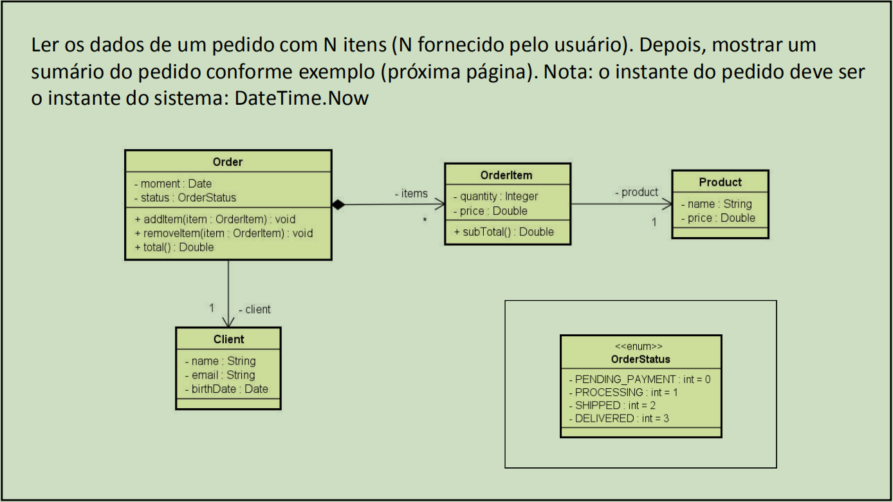
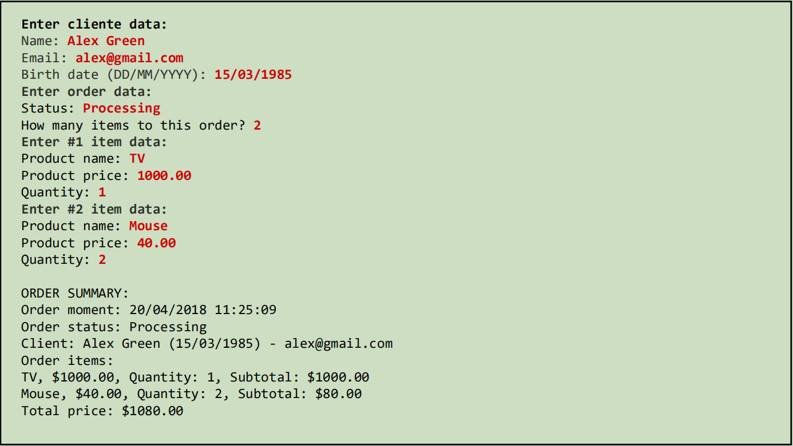
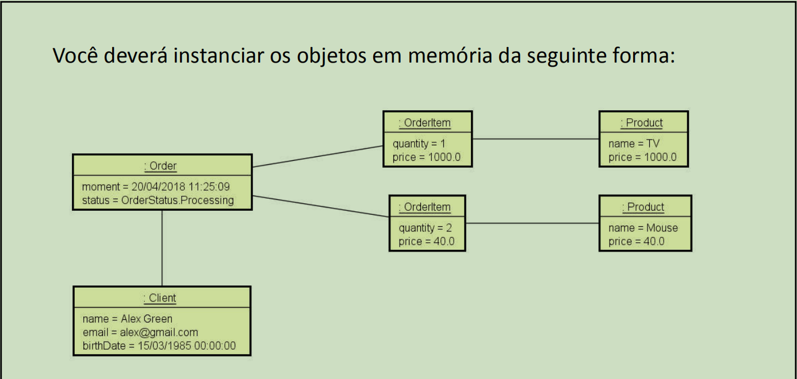

# Enumerações e Composição

É uma atividade do *Módulo 9* do curso de `C# Completo Programação Orientada a Objetos (POO)` Do professor `Nélio Alves`. 
Curso existente na plataforma [Udemy](https://www.udemy.com/course/programacao-orientada-a-objetos-csharp/).

* Entendendo e implementando os conceitos Enumerações;
* Entendendo e implementando os conceitos de Composição;
* Atividade relativa ao que foi aprendido no capitulo, segue exercício:

Autor: `Matheus Glauber Rodrigues Jordão` [Linkedin](https://www.linkedin.com/in/matheusglauber/).
